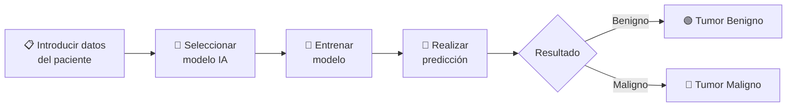

# 🔬 Sistema de Detección de Tumores con Machine Learning

    🧬

---

## 🎯 ¿Qué es este proyecto?

Este proyecto es una **aplicación web completa de inteligencia artificial** diseñada para la **detección y clasificación de tumores mamarios** (benignos o malignos) utilizando algoritmos de **Machine Learning**. Combina un backend en Python con un frontend interactivo para ofrecer predicciones en tiempo real.

!!! warning "Aviso Importante"
    Este sistema es una **herramienta de apoyo educativa y demostrativa**. El diagnóstico final siempre debe ser realizado por un **profesional médico cualificado**.

---

## 🧠 Modelos de IA Disponibles

La aplicación permite elegir entre **5 modelos de Machine Learning** diferentes para realizar las predicciones:

| Modelo | Descripción |
|--------|-------------|
| :material-forest: **Random Forest** | Ensemble de árboles de decisión para alta precisión |
| :material-lightning-bolt: **XGBoost** | Gradient boosting optimizado y eficiente |
| :material-target: **AdaBoost** | Boosting adaptativo que mejora iterativamente |
| :material-chart-line: **Gradient Boosting** | Boosting por gradiente con ajuste fino |
| :material-vote: **Voting Classifier** | Combinación inteligente de múltiples modelos |

---

## ⚙️ ¿Cómo funciona?

### Flujo de trabajo

1. **Iniciar sesión** en la aplicación
2. **Seleccionar** uno de los 5 modelos disponibles
3. **Entrenar** el modelo seleccionado
4. **Introducir datos** del paciente (30 características clínicas) o cargar datos de ejemplo
5. **Obtener la predicción** con probabilidades detalladas

---

## 📊 Datos de Entrada

La aplicación analiza **30 características clínicas** organizadas en 3 categorías:

-   :material-chart-bar:{ .lg .middle } **Valores Medios**

    ---

    Radio, textura, perímetro, área, suavidad, compacidad, concavidad, puntos cóncavos, simetría y dimensión fractal

-   :material-chart-bell-curve:{ .lg .middle } **Errores Estándar**

    ---

    Error de cada una de las 10 mediciones anteriores, indicando la variabilidad

-   :material-alert:{ .lg .middle } **Valores Peores (Worst)**

    ---

    Los valores máximos/peores de cada medición para evaluar los casos extremos

---

## 🎨 Características de la Aplicación

- ✅ **Interfaz intuitiva** con modo oscuro/claro
- ✅ **Datos de ejemplo** incluidos (benigno, maligno y aleatorio)
- ✅ **Responsive** - Funciona en móvil, tablet y escritorio
- ✅ **Probabilidades detalladas** en cada predicción
- ✅ **Estado visual** de los modelos entrenados

---

## 🚀 Accede a la Aplicación

-   :material-rocket-launch:{ .lg .middle } **Probar la Aplicación**

    ---

    Accede al sistema de detección de tumores en vivo y pruébalo tú mismo.

    [:octicons-arrow-right-24: Ir a la aplicación](https://tumores.fmgarcia.com/){ target="_blank" }

-   :material-book-open-variant:{ .lg .middle } **Documentación de Uso**

    ---

    Consulta el manual completo con instrucciones detalladas de uso.

    [:octicons-arrow-right-24: Ver documentación](https://github.com/fmgarcia/Curso_Python_IA_nov25/blob/main/Proyecto_completo/docs/uso.md){ target="_blank" }

-   :fontawesome-brands-github:{ .lg .middle } **Código Fuente**

    ---

    Explora el repositorio completo del proyecto en GitHub.

    [:octicons-arrow-right-24: Ver en GitHub](https://github.com/fmgarcia/Curso_Python_IA_nov25/tree/main/Proyecto_completo){ target="_blank" }

---

    <a href="https://tumores.fmgarcia.com/" target="_blank" class="md-button md-button--primary" style="margin: 0.5rem;">
        🔬 Probar Ahora
    </a>
    <a href="../" class="md-button" style="margin: 0.5rem;">
        ← Volver al Portfolio
    </a>

